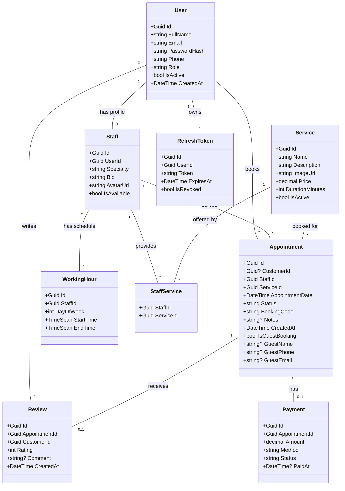
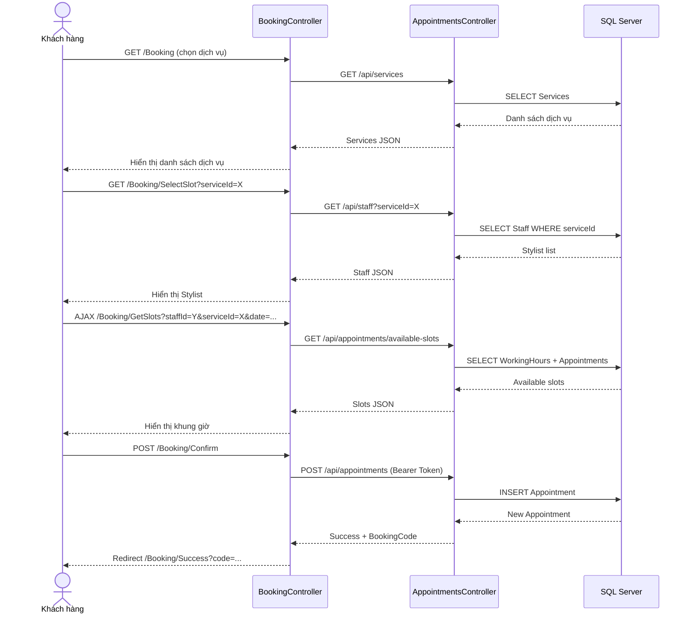
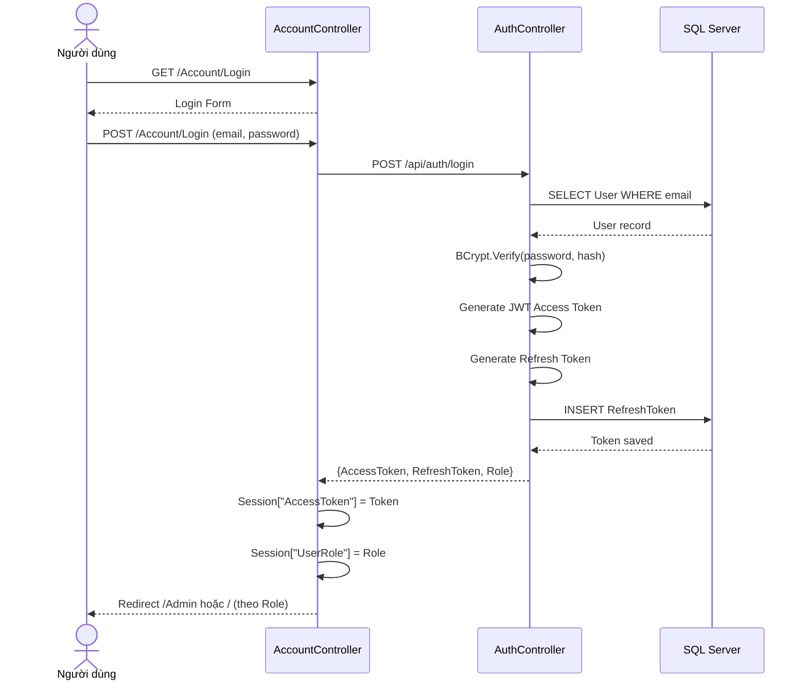

# LUXE Hair Salon – Hệ thống đặt lịch salon trực tuyến

## Mục lục

1. [Giới thiệu](#1-giới-thiệu)
2. [Kiến trúc hệ thống](#2-kiến-trúc-hệ-thống)
3. [Cấu trúc dự án](#3-cấu-trúc-dựán)
4. [Tính năng đã triển khai](#4-tính-năng-đã-triển-khai)
5. [Security & Validation](#5-security--validation)
6. [Hướng dẫn Demo](#6-hướng-dẫn-demo)
7. [Sơ đồ UML](#7-sơ-đồ-uml)
8. [Entity Relationship Diagram (ERD)](#8-entity-relationship-diagram-erd)
9. [API Endpoints](#9-api-endpoints)
10. [Tài khoản Demo](#10-tài-khoản-demo)
11. [Chạy ứng dụng](#11-chạy-ứng-dụng)

---

## 1. Giới thiệu

**LUXE Hair Salon** là hệ thống đặt lịch làm tóc trực tuyến, xây dựng theo kiến trúc **API + MVC**, phục vụ ba nhóm người dùng: **Khách hàng**, **Stylist (Nhân viên)** và **Quản trị viên**.

### Công nghệ sử dụng

| Thành phần | Công nghệ |
|------------|-----------|
| Backend API | ASP.NET Core 8.0 Web API |
| Frontend | ASP.NET Core 8.0 MVC (Razor) |
| Cơ sở dữ liệu | SQL Server + Entity Framework Core 8 |
| Xác thực | JWT Bearer + Refresh Token |
| Giao diện | CSS tùy chỉnh, Responsive |
| Bảo mật | Rate Limiting, Audit Logging, Security Headers |

---

## 2. Kiến trúc hệ thống

```
┌─────────────┐     ┌─────────────────┐     ┌────────────────┐
│   Browser    │────▶│  HairSalonVN.Web │────▶│  HairSalonVN.API │
│  (Trình duyệt)│     │   (ASP.NET MVC)   │     │  (ASP.NET Core) │
└─────────────┘     └─────────────────┘     └────────┬───────┘
                                                     │
                                                     ▼
                                              ┌────────────────┐
                                              │   SQL Server    │
                                              │   (Database)   │
                                              └────────────────┘
```

### Luồng dữ liệu
1. **Client** → **Web (MVC)** → Gửi request với JWT token từ Session
2. **Web (MVC)** → **API** → HttpClient gọi REST API
3. **API** → **Database** → Entity Framework Core truy vấn SQL Server

---

## 3. Cấu trúc dự án

```
HairSalonVN/
├── HairSalonVN.API/                    # REST API
│   ├── Controllers/                     # Auth, Appointments, Services, Staff, Reviews, Payments
│   ├── Services/                       # AuthService, AppointmentService, ServiceService
│   ├── Services/DTOs/                  # Data Transfer Objects
│   ├── Middleware/                     # RateLimiting, AuditLog, ExceptionMiddleware
│   ├── Helpers/                        # JwtHelper, ValidationHelper
│   └── Extensions/                     # ClaimsPrincipalExtensions
│
├── HairSalonVN.Web/                   # MVC Frontend
│   ├── Controllers/                   # Home, Account, Booking, Admin, Staff
│   ├── Models/                       # ViewModels
│   ├── Services/                     # ApiClient (HTTP calls)
│   ├── Views/                        # Razor Views
│   ├── wwwroot/css/                  # salon.css, landing.css
│   └── wwwroot/js/                   # salon.js
│
└── HairSalonVN.Database/             # Data Layer
    ├── Entities/                      # 9 Entity classes
    ├── Configurations/                # Fluent API
    ├── Migrations/                   # EF Core migrations
    └── Seeders/                      # Demo data
```

---

## 4. Tính năng đã triển khai

### 4.1. Khách hàng (Customer)

| Tính năng | Mô tả |
|-----------|--------|
| Trang chủ | Landing page với hero, dịch vụ nổi bật, đánh giá |
| Đăng ký/Đăng nhập | Tạo tài khoản, JWT + Session |
| Đặt lịch 3 bước | Chọn dịch vụ → Stylist & Giờ → Xác nhận |
| Guest booking | Khách chưa đăng nhập vẫn đặt được |
| Lịch của tôi | Xem, lọc theo trạng thái, hủy lịch |
| Đánh giá | Gửi review 1-5 sao sau khi hoàn thành |

### 4.2. Stylist (Staff)

| Tính năng | Mô tả |
|-----------|--------|
| Dashboard | Lịch hôm nay, thống kê pending/completed |
| Cập nhật trạng thái | Xác nhận / Hoàn thành lịch được gán |

### 4.3. Quản trị (Admin)

| Tính năng | Mô tả |
|-----------|--------|
| Dashboard | Thống kê lịch hẹn, doanh thu tháng |
| Quản lý lịch hẹn | Duyệt, đổi trạng thái |
| Quản lý dịch vụ | CRUD dịch vụ |
| Quản lý nhân viên | Xem danh sách stylist |
| Báo cáo | Doanh thu, dịch vụ top, nhân viên xuất sắc |

---

## 5. Security & Validation

### 5.1. Bảo mật đã triển khai

| Tính năng | Mô tả |
|-----------|--------|
| **Rate Limiting** | Giới hạn 100 requests/phút/client |
| **Audit Logging** | Ghi log POST/PUT/DELETE cho auth, appointments, payments |
| **Security Headers** | X-Content-Type-Options, X-Frame-Options, XSS Protection |
| **Password Validation** | 8+ ký tự, 1 uppercase, 1 số, 1 ký tự đặc biệt |
| **JWT Validation** | Access Token 15 phút, Refresh Token 7 ngày |
| **SQL Injection Prevention** | Parameterized queries, EF Core |

### 5.2. Validation Input

- **Email**: Format chuẩn, unique constraint
- **Phone**: 10-15 chữ số, format Việt Nam
- **Name**: 2-100 ký tự, chỉ chữ và khoảng trắng
- **Appointment**: Kiểm tra giờ làm việc, slot trống, staff availability
- **Guest Booking**: Validate thông tin khách trước khi tạo

---

## 6. Hướng dẫn Demo

### 6.1. Yêu cầu

- .NET 8 SDK
- SQL Server (LocalDB hoặc SQL Server Express)
- 2 terminal/command prompt

### 6.2. Bước 1: Chạy API

```bash
cd HairSalonVN.API
dotnet run
# API chạy tại: http://localhost:7098
# Swagger UI: http://localhost:7098/swagger
```

### 6.3. Bước 2: Chạy Web

```bash
cd HairSalonVN.Web
dotnet run
# Web chạy tại: http://localhost:7126
```

### 6.4. Bước 3: Demo các luồng chính

#### Luồng 1: Đặt lịch (Khách vãng lai)

1. Mở trình duyệt → `http://localhost:7126`
2. Click **Đặt lịch ngay**
3. **Bước 1**: Chọn dịch vụ (VD: Cắt Tóc Nam)
4. **Bước 2**: Chọn ngày → Stylist tự động tải → Click chọn giờ trống
5. **Bước 3**: Điền họ tên, SĐT → Submit
6. Nhận mã đặt lịch (VD: `HS260528XXXXXX`)

#### Luồng 2: Đặt lịch (Khách đã đăng nhập)

1. Đăng nhập: `mai.pham@gmail.com` / `Customer@123`
2. Vào **Đặt lịch** → Chọn dịch vụ → Stylist → Giờ → Xác nhận
3. Lịch hẹn tự động ghi nhận thông tin từ tài khoản

#### Luồng 3: Quản lý Admin

1. Đăng nhập: `admin@luxehair.vn` / `Admin@123`
2. **Dashboard**: Xem tổng quan doanh thu, lịch hẹn
3. **Lịch hẹn**: Duyệt (Pending → Confirmed → Completed)
4. **Dịch vụ**: Thêm/Sửa/Xóa dịch vụ
5. **Báo cáo**: Xem doanh thu, top dịch vụ

#### Luồng 4: Stylist quản lý lịch

1. Đăng nhập: `tai.nguyen@luxehair.vn` / `Staff@123`
2. Dashboard hiện lịch hẹn hôm nay
3. Cập nhật trạng thái: Pending → Confirmed → Completed

#### Luồng 5: Đánh giá dịch vụ

1. Đăng nhập khách hàng
2. Vào **Lịch của tôi**
3. Tìm lịch **Hoàn thành** + chưa đánh giá
4. Click **Đánh giá** → Chọn sao + nhận xét → Gửi

### 6.5. Test API qua Swagger

1. Mở `http://localhost:7098/swagger`
2. Endpoint công khai:
   - `GET /api/services` - Danh sách dịch vụ
   - `GET /api/staff` - Danh sách stylist
   - `GET /api/appointments/available-slots` - Khung giờ trống
3. Endpoint cần token:
   - Đăng nhập `POST /api/auth/login`
   - Copy token từ response
   - Click **Authorize** → Dán token → Test các endpoint

---

## 7. Sơ đồ UML

### 7.1. Sơ đồ Use Case

```mermaid
flowchart TB
    subgraph Actors["Actors (4)"]
        A1((Khách vãng lai))
        A2((Khách hàng))
        A3((Stylist))
        A4((Admin))
    end

    subgraph UseCases["Use Cases (17)"]
        UC01[Xem trang chủ]
        UC02[Đăng ký]
        UC03[Đăng nhập]
        UC04[Đăng xuất]
        UC05[Đặt lịch - Guest]
        UC06[Đặt lịch - KH]
        UC07[Xem lịch của tôi]
        UC08[Hủy lịch]
        UC09[Đánh giá]
        UC10[Xem ca làm việc]
        UC11[Cập nhật TT lịch]
        UC12[Dashboard Admin]
        UC13[QL Lịch hẹn]
        UC14[Thêm dịch vụ]
        UC15[Sửa dịch vụ]
        UC16[Xóa dịch vụ]
        UC17[Xem nhân viên]
    end

    A1 --> UC01
    A1 --> UC02
    A1 --> UC05
    A2 --> UC01
    A2 --> UC03
    A2 --> UC04
    A2 --> UC06
    A2 --> UC07
    A2 --> UC08
    A2 --> UC09
    A3 --> UC03
    A3 --> UC04
    A3 --> UC10
    A3 --> UC11
    A4 --> UC03
    A4 --> UC04
    A4 --> UC12
    A4 --> UC13
    A4 --> UC14
    A4 --> UC15
    A4 --> UC16
    A4 --> UC17
```



### 7.2. Sơ đồ Class (Entity Model)



### 7.3. Sơ đồ Sequence - Đặt lịch



### 7.4. Sơ đồ Sequence - Đăng nhập



---

## 8. Entity Relationship Diagram (ERD)

```mermaid
erDiagram
    USERS {
        guid Id PK
        string FullName
        string Email UK
        string PasswordHash
        string Phone
        string Role
        bool IsActive
        datetime CreatedAt
    }

    STAFFS {
        guid Id PK
        guid UserId FK
        string Specialty
        string Bio
        string AvatarUrl
        bool IsAvailable
        datetime CreatedAt
    }

    SERVICES {
        guid Id PK
        string Name
        string Description
        string ImageUrl
        decimal Price
        int DurationMinutes
        bool IsActive
    }

    STAFF_SERVICES {
        guid StaffId FK
        guid ServiceId FK
    }

    WORKING_HOURS {
        guid Id PK
        guid StaffId FK
        int DayOfWeek
        time StartTime
        time EndTime
    }

    APPOINTMENTS {
        guid Id PK
        guid CustomerId FK "nullable"
        guid StaffId FK
        guid ServiceId FK
        datetime AppointmentDate
        string Status
        string BookingCode
        string Notes
        datetime CreatedAt
        bool IsGuestBooking
        string GuestName
        string GuestPhone
        string GuestEmail
    }

    REVIEWS {
        guid Id PK
        guid AppointmentId FK UK
        guid CustomerId FK
        int Rating
        string Comment
        datetime CreatedAt
    }

    PAYMENTS {
        guid Id PK
        guid AppointmentId FK UK
        decimal Amount
        string Method
        string Status
        datetime PaidAt
    }

    REFRESH_TOKENS {
        guid Id PK
        guid UserId FK
        string Token
        datetime ExpiresAt
        bool IsRevoked
    }

    USERS ||--o| STAFFS : "1-to-0..1"
    USERS ||--o{ REFRESH_TOKENS : "1-to-many"
    USERS ||--o{ APPOINTMENTS : "1-to-many"
    USERS ||--o{ REVIEWS : "1-to-many"
    STAFFS ||--o{ WORKING_HOURS : "1-to-many"
    STAFFS ||--o{ APPOINTMENTS : "1-to-many"
    STAFFS ||--o{ STAFF_SERVICES : "1-to-many"
    SERVICES ||--o{ STAFF_SERVICES : "1-to-many"
    SERVICES ||--o{ APPOINTMENTS : "1-to-many"
    APPOINTMENTS ||--o| REVIEWS : "1-to-0..1"
    APPOINTMENTS ||--o| PAYMENTS : "1-to-0..1"
```

### Mối quan hệ chi tiết

| Bảng 1 | Quan hệ | Bảng 2 | Mô tả |
|--------|---------|---------|--------|
| Users | 1:0..1 | Staffs | Mỗi User có thể là Staff |
| Users | 1:N | Appointments | User đặt nhiều lịch |
| Users | 1:N | Reviews | User viết nhiều review |
| Users | 1:N | RefreshTokens | User có nhiều token |
| Staffs | 1:N | WorkingHours | Staff có nhiều giờ làm |
| Staffs | 1:N | Appointments | Staff phục vụ nhiều lịch |
| Staffs | N:N | Services | Staff cung cấp nhiều dịch vụ |
| Services | 1:N | Appointments | Service được đặt nhiều lần |
| Appointments | 1:0..1 | Reviews | Appointment có thể có review |
| Appointments | 1:0..1 | Payments | Appointment có thể có payment |

---

## 9. API Endpoints

### 9.1. Authentication

| Method | Endpoint | Mô tả | Auth |
|--------|----------|--------|------|
| POST | `/api/auth/register` | Đăng ký tài khoản mới | ❌ |
| POST | `/api/auth/login` | Đăng nhập | ❌ |
| POST | `/api/auth/refresh` | Làm mới token | ❌ |
| POST | `/api/auth/logout` | Đăng xuất | ✅ |
| GET | `/api/auth/me` | Thông tin user hiện tại | ✅ |

### 9.2. Services

| Method | Endpoint | Mô tả | Auth |
|--------|----------|--------|------|
| GET | `/api/services` | Danh sách dịch vụ | ❌ |
| GET | `/api/services/{id}` | Chi tiết dịch vụ | ❌ |
| GET | `/api/services/by-service/{id}` | Stylist theo dịch vụ | ❌ |
| POST | `/api/services` | Tạo dịch vụ mới | ✅ Admin |
| PUT | `/api/services/{id}` | Cập nhật dịch vụ | ✅ Admin |
| DELETE | `/api/services/{id}` | Xóa dịch vụ | ✅ Admin |

### 9.3. Staff

| Method | Endpoint | Mô tả | Auth |
|--------|----------|--------|------|
| GET | `/api/staff` | Danh sách stylist | ❌ |
| GET | `/api/staff/me` | Thông tin stylist hiện tại | ✅ Staff |
| GET | `/api/staff/{id}` | Chi tiết stylist | ❌ |
| PUT | `/api/staff/{id}/working-hours` | Cập nhật giờ làm | ✅ Admin |

### 9.4. Appointments

| Method | Endpoint | Mô tả | Auth |
|--------|----------|--------|------|
| GET | `/api/appointments` | Tất cả lịch hẹn | ✅ |
| GET | `/api/appointments/my` | Lịch của tôi | ✅ |
| GET | `/api/appointments/{id}` | Chi tiết lịch hẹn | ✅ |
| GET | `/api/appointments/available-slots` | Khung giờ trống | ❌ |
| POST | `/api/appointments` | Tạo lịch hẹn | ✅ |
| POST | `/api/appointments/guest` | Tạo lịch (khách) | ❌ |
| PUT | `/api/appointments/{id}/status` | Cập nhật trạng thái | ✅ |

### 9.5. Reviews

| Method | Endpoint | Mô tả | Auth |
|--------|----------|--------|------|
| GET | `/api/reviews` | Tất cả đánh giá | ❌ |
| GET | `/api/reviews/service/{id}` | Đánh giá theo dịch vụ | ❌ |
| GET | `/api/reviews/staff/{id}` | Đánh giá theo stylist | ❌ |
| POST | `/api/reviews` | Tạo đánh giá | ✅ |

### 9.6. Payments

| Method | Endpoint | Mô tả | Auth |
|--------|----------|--------|------|
| GET | `/api/payments` | Danh sách thanh toán | ✅ Admin |
| GET | `/api/payments/summary` | Tổng hợp doanh thu | ✅ Admin |

---

## 10. Tài khoản Demo

### Admin
| Email | Mật khẩu |
|-------|-----------|
| `admin@luxehair.vn` | `Admin@123` |

### Stylist
| Email | Mật khẩu | Chuyên môn |
|-------|-----------|------------|
| `tai.nguyen@luxehair.vn` | `Staff@123` | Cắt & Nhuộm |
| `nam.tran@luxehair.vn` | `Staff@123` | Uốn & Duỗi |
| `huong.le@luxehair.vn` | `Staff@123` | Nhuộm & Tạo mẫu |

### Khách hàng
| Email | Mật khẩu |
|-------|-----------|
| `mai.pham@gmail.com` | `Customer@123` |
| `hung.le@yahoo.com` | `Customer@123` |
| `chau.tran@outlook.com` | `Customer@123` |

---

## 11. Chạy ứng dụng

### Cấu hình

**appsettings.json (API)**:
```json
{
  "ConnectionStrings": {
    "DefaultConnection": "Server=localhost;Database=HairSalonDB;..."
  },
  "JwtSettings": {
    "SecretKey": "YourSecretKeyAtLeast32Characters",
    "AccessTokenExpiryMinutes": 15,
    "RefreshTokenExpiryDays": 7
  }
}
```

**appsettings.json (Web)**:
```json
{
  "ApiSettings": {
    "BaseUrl": "http://localhost:7098/api"
  }
}
```

### Chạy

```bash
# Terminal 1 - API
cd HairSalonVN.API
dotnet run

# Terminal 2 - Web
cd HairSalonVN.Web
dotnet run
```

### Migration (lần đầu)

```bash
cd HairSalonVN.API
dotnet ef database update --project ../HairSalonVN.Database
```

---

## Changelog

### 2026-05-28 - Security & Validation Update

**New Features:**
- Rate Limiting Middleware (100 req/min)
- Audit Log Middleware
- Security Headers (X-Content-Type-Options, X-Frame-Options, etc.)
- Enhanced Password Validation (8+ chars, uppercase, number, special char)
- Enhanced Input Validation (email, phone, name)

**Files Added:**
- `Middleware/RateLimitingMiddleware.cs`
- `Middleware/AuditLogMiddleware.cs`
- `Helpers/ValidationHelper.cs`

**Files Updated:**
- `Program.cs` - Middleware pipeline, security headers
- `DTOs/Auth/RegisterDto.cs` - Enhanced validation
- `DTOs/Auth/LoginDto.cs` - Error messages
- `DTOs/Appointment/AppointmentCreateDto.cs` - IValidatableObject
- `Models/Auth/RegisterViewModel.cs` - Web validation
- `Services/ServiceManageViewModel.cs` - Admin validation

---

**Build Status:** ✅ HairSalonVN.API - 0 warnings, 0 errors
**Build Status:** ✅ HairSalonVN.Web - 0 warnings, 0 errors

*Dự án phục vụ mục đích học tập môn Lập trình ADO.NET / ASP.NET Core*


const {
  Document, Packer, Paragraph, TextRun, Table, TableRow, TableCell,
  Header, Footer, AlignmentType, HeadingLevel, BorderStyle, WidthType,
  ShadingType, VerticalAlign, PageNumber, PageBreak, LevelFormat,
  TableOfContents, ImageRun
} = require('docx');
const fs = require('fs');
const { createCanvas } = require('canvas');

// ─── COLOR PALETTE ───────────────────────────────────────────────
const BLUE   = "1F4E79";
const LBLUE  = "2E75B6";
const ACCENT = "D6E4F0";
const GRAY   = "595959";
const LGRAY  = "F2F2F2";
const WHITE  = "FFFFFF";
const GREEN  = "375623";
const LGREEN = "E2EFDA";

// ─── HELPER: cell border ─────────────────────────────────────────
const cellBorder = (color = "CCCCCC") => {
  const b = { style: BorderStyle.SINGLE, size: 1, color };
  return { top: b, bottom: b, left: b, right: b };
};

// ─── HELPER: styled paragraph ────────────────────────────────────
function para(text, opts = {}) {
  return new Paragraph({
    alignment: opts.center ? AlignmentType.CENTER : AlignmentType.LEFT,
    spacing: { before: opts.before ?? 80, after: opts.after ?? 80 },
    children: [new TextRun({
      text,
      bold:   opts.bold   ?? false,
      italic: opts.italic ?? false,
      size:   opts.size   ?? 22,
      color:  opts.color  ?? "000000",
      font:   "Times New Roman",
    })]
  });
}

function heading1(text) {
  return new Paragraph({
    heading: HeadingLevel.HEADING_1,
    spacing: { before: 360, after: 200 },
    children: [new TextRun({ text, bold: true, size: 32, color: BLUE, font: "Arial" })]
  });
}

function heading2(text) {
  return new Paragraph({
    heading: HeadingLevel.HEADING_2,
    spacing: { before: 280, after: 140 },
    children: [new TextRun({ text, bold: true, size: 26, color: LBLUE, font: "Arial" })]
  });
}

function heading3(text) {
  return new Paragraph({
    heading: HeadingLevel.HEADING_3,
    spacing: { before: 200, after: 100 },
    children: [new TextRun({ text, bold: true, size: 24, color: "1A1A1A", font: "Arial" })]
  });
}

function bullet(text) {
  return new Paragraph({
    numbering: { reference: "bullets", level: 0 },
    spacing: { before: 60, after: 60 },
    children: [new TextRun({ text, size: 22, font: "Times New Roman" })]
  });
}

function bodyText(text) {
  return para(text, { before: 100, after: 100 });
}

// ─── TABLE BUILDER ────────────────────────────────────────────────
function buildTable(headers, rows, colWidths) {
  const totalWidth = colWidths.reduce((a, b) => a + b, 0);
  const headerBorder = cellBorder("2E75B6");
  const rowBorder = cellBorder("CCCCCC");

  const makeCell = (text, width, isHeader) => new TableCell({
    width: { size: width, type: WidthType.DXA },
    borders: isHeader ? headerBorder : rowBorder,
    shading: { fill: isHeader ? LBLUE : WHITE, type: ShadingType.CLEAR },
    margins: { top: 80, bottom: 80, left: 120, right: 120 },
    verticalAlign: VerticalAlign.CENTER,
    children: [new Paragraph({
      alignment: AlignmentType.LEFT,
      children: [new TextRun({ text, bold: isHeader, size: isHeader ? 20 : 20,
        color: isHeader ? WHITE : "000000", font: "Arial" })]
    })]
  });

  return new Table({
    width: { size: totalWidth, type: WidthType.DXA },
    columnWidths: colWidths,
    rows: [
      new TableRow({ children: headers.map((h, i) => makeCell(h, colWidths[i], true)) }),
      ...rows.map((row, ri) => new TableRow({
        children: row.map((cell, i) => makeCell(cell, colWidths[i], false))
      }))
    ]
  });
}

// ─── CREATE SVG DIAGRAMS AS PNG BUFFERS ──────────────────────────
function svgToPngBuffer(svgContent, width, height) {
  // We'll write SVG files and include as placeholder images for now
  // Using canvas to draw diagrams
  const canvas = createCanvas(width, height);
  const ctx = canvas.getContext('2d');
  return canvas.toBuffer('image/png');
}

// Draw Use Case diagram
function drawUseCaseDiagram() {
  const w = 900, h = 620;
  const canvas = createCanvas(w, h);
  const ctx = canvas.getContext('2d');

  // Background
  ctx.fillStyle = '#F8FAFD';
  ctx.fillRect(0, 0, w, h);

  // Title
  ctx.fillStyle = '#1F4E79';
  ctx.font = 'bold 22px Arial';
  ctx.textAlign = 'center';
  ctx.fillText('Sơ đồ Use Case – LUXE Hair Salon', w/2, 38);

  // Border
  ctx.strokeStyle = '#2E75B6';
  ctx.lineWidth = 2;
  ctx.strokeRect(4, 4, w-8, h-8);

  // Actors box
  const actors = [
    { label: 'Khách vãng lai', x: 60, y: 100 },
    { label: 'Khách hàng', x: 60, y: 220 },
    { label: 'Stylist', x: 60, y: 360 },
    { label: 'Admin', x: 60, y: 480 },
  ];

  function drawActor(ctx, label, x, y) {
    // Head
    ctx.strokeStyle = '#1F4E79';
    ctx.lineWidth = 2;
    ctx.beginPath();
    ctx.arc(x, y - 28, 14, 0, Math.PI * 2);
    ctx.stroke();
    // Body
    ctx.beginPath();
    ctx.moveTo(x, y-14); ctx.lineTo(x, y+20);
    ctx.stroke();
    // Arms
    ctx.beginPath();
    ctx.moveTo(x-18, y); ctx.lineTo(x+18, y);
    ctx.stroke();
    // Legs
    ctx.beginPath();
    ctx.moveTo(x, y+20); ctx.lineTo(x-14, y+44);
    ctx.moveTo(x, y+20); ctx.lineTo(x+14, y+44);
    ctx.stroke();
    // Label
    ctx.fillStyle = '#1F4E79';
    ctx.font = 'bold 13px Arial';
    ctx.textAlign = 'center';
    ctx.fillText(label, x, y+62);
  }

  actors.forEach(a => drawActor(ctx, a.label, a.x, a.y));

  // Use case ellipses
  const usecases = [
    // Khách vãng lai
    { label: 'Xem trang chủ',         x: 300, y: 80,  actor: [0] },
    { label: 'Đăng ký tài khoản',     x: 540, y: 80,  actor: [0] },
    { label: 'Đặt lịch (Guest)',       x: 300, y: 155, actor: [0] },
    // Khách hàng
    { label: 'Đăng nhập',             x: 540, y: 155, actor: [1,2,3] },
    { label: 'Đặt lịch (Đã đăng nhập)',x: 300, y: 230, actor: [1] },
    { label: 'Xem lịch của tôi',      x: 540, y: 230, actor: [1] },
    { label: 'Hủy lịch hẹn',          x: 300, y: 305, actor: [1] },
    { label: 'Gửi đánh giá',          x: 540, y: 305, actor: [1] },
    // Stylist
    { label: 'Xem ca làm việc',       x: 300, y: 380, actor: [2] },
    { label: 'Cập nhật trạng thái lịch', x: 540, y: 380, actor: [2] },
    // Admin
    { label: 'Dashboard thống kê',    x: 300, y: 455, actor: [3] },
    { label: 'Quản lý lịch hẹn',      x: 540, y: 455, actor: [3] },
    { label: 'CRUD dịch vụ',          x: 300, y: 530, actor: [3] },
    { label: 'Xem báo cáo doanh thu', x: 540, y: 530, actor: [3] },
  ];

  const actorY = [100, 220, 360, 480];
  const actorX = 60;

  usecases.forEach(uc => {
    // Ellipse
    ctx.save();
    ctx.strokeStyle = '#2E75B6';
    ctx.lineWidth = 1.5;
    ctx.fillStyle = '#EBF3FB';
    ctx.beginPath();
    ctx.ellipse(uc.x, uc.y, 110, 26, 0, 0, Math.PI * 2);
    ctx.fill();
    ctx.stroke();
    ctx.restore();
    // Label
    ctx.fillStyle = '#1F4E79';
    ctx.font = '12px Arial';
    ctx.textAlign = 'center';
    ctx.fillText(uc.label, uc.x, uc.y + 5);

    // Lines to actors
    uc.actor.forEach(ai => {
      ctx.strokeStyle = '#9BB8D4';
      ctx.lineWidth = 1;
      ctx.setLineDash([4,3]);
      ctx.beginPath();
      ctx.moveTo(actorX + 22, actorY[ai]);
      ctx.lineTo(uc.x - 110, uc.y);
      ctx.stroke();
      ctx.setLineDash([]);
    });
  });

  // System boundary
  ctx.strokeStyle = '#1F4E79';
  ctx.lineWidth = 2;
  ctx.setLineDash([8,4]);
  ctx.strokeRect(165, 52, 720, 515);
  ctx.setLineDash([]);
  ctx.fillStyle = '#2E75B6';
  ctx.font = 'italic bold 13px Arial';
  ctx.textAlign = 'left';
  ctx.fillText('Hệ thống LUXE Hair Salon', 170, 70);

  return canvas.toBuffer('image/png');
}

// Draw Architecture diagram
function drawArchDiagram() {
  const w = 900, h = 420;
  const canvas = createCanvas(w, h);
  const ctx = canvas.getContext('2d');
  ctx.fillStyle = '#F8FAFD';
  ctx.fillRect(0, 0, w, h);

  ctx.strokeStyle = '#2E75B6';
  ctx.lineWidth = 2;
  ctx.strokeRect(4, 4, w-8, h-8);

  ctx.fillStyle = '#1F4E79';
  ctx.font = 'bold 20px Arial';
  ctx.textAlign = 'center';
  ctx.fillText('Kiến trúc Hệ thống – API + MVC', w/2, 38);

  function drawBox(label, sub, x, y, bw, bh, fillColor, textColor) {
    ctx.fillStyle = fillColor;
    ctx.beginPath();
    ctx.roundRect(x, y, bw, bh, 12);
    ctx.fill();
    ctx.strokeStyle = '#2E75B6';
    ctx.lineWidth = 2;
    ctx.beginPath();
    ctx.roundRect(x, y, bw, bh, 12);
    ctx.stroke();
    ctx.fillStyle = textColor || '#FFFFFF';
    ctx.font = 'bold 15px Arial';
    ctx.textAlign = 'center';
    ctx.fillText(label, x + bw/2, y + bh/2 - (sub ? 8 : 0));
    if (sub) {
      ctx.font = '12px Arial';
      ctx.fillText(sub, x + bw/2, y + bh/2 + 14);
    }
  }

  function arrow(x1, y1, x2, y2, label) {
    ctx.strokeStyle = '#1F4E79';
    ctx.lineWidth = 2;
    ctx.beginPath();
    ctx.moveTo(x1, y1);
    ctx.lineTo(x2, y2);
    ctx.stroke();
    // Arrowhead
    const angle = Math.atan2(y2-y1, x2-x1);
    ctx.beginPath();
    ctx.moveTo(x2, y2);
    ctx.lineTo(x2 - 12*Math.cos(angle-0.4), y2 - 12*Math.sin(angle-0.4));
    ctx.lineTo(x2 - 12*Math.cos(angle+0.4), y2 - 12*Math.sin(angle+0.4));
    ctx.closePath();
    ctx.fillStyle = '#1F4E79';
    ctx.fill();
    if (label) {
      ctx.fillStyle = '#595959';
      ctx.font = '11px Arial';
      ctx.textAlign = 'center';
      const mx = (x1+x2)/2, my = (y1+y2)/2;
      ctx.fillText(label, mx, my - 8);
    }
  }

  // Layer 1: Browser
  drawBox('Trình duyệt', '(Browser / Client)', 50, 160, 150, 90, '#1F4E79');
  // Layer 2: MVC Web
  drawBox('HairSalonVN.Web', 'ASP.NET Core MVC\n(Razor Views)', 280, 140, 200, 110, '#2E75B6');
  // Layer 3: API
  drawBox('HairSalonVN.API', 'ASP.NET Core\nWeb API', 560, 140, 200, 110, '#375623');
  // Layer 4: DB
  drawBox('SQL Server', 'Entity Framework Core 8', 730, 310, 155, 80, '#7F5539', '#FFFFFF');

  // Arrows
  arrow(200, 205, 280, 205, 'HTTP Request');
  arrow(480, 205, 560, 205, 'REST API\n(JWT Bearer)');
  arrow(660, 250, 730, 335, 'EF Core\nQuery');

  // Reverse arrows (dashed)
  ctx.setLineDash([5,4]);
  ctx.strokeStyle = '#9BB8D4';
  ctx.lineWidth = 1.5;
  ctx.beginPath(); ctx.moveTo(280, 220); ctx.lineTo(200, 220); ctx.stroke();
  ctx.beginPath(); ctx.moveTo(560, 220); ctx.lineTo(480, 220); ctx.stroke();
  ctx.beginPath(); ctx.moveTo(730, 350); ctx.lineTo(680, 285); ctx.stroke();
  ctx.setLineDash([]);

  // Sub-components box
  const subX = 280, subY = 270;
  ctx.fillStyle = '#EBF3FB';
  ctx.beginPath(); ctx.roundRect(subX, subY, 200, 120, 8); ctx.fill();
  ctx.strokeStyle = '#2E75B6'; ctx.lineWidth = 1;
  ctx.beginPath(); ctx.roundRect(subX, subY, 200, 120, 8); ctx.stroke();
  ctx.fillStyle = '#1F4E79'; ctx.font = 'bold 11px Arial'; ctx.textAlign = 'left';
  ctx.fillText('MVC Components:', subX+10, subY+20);
  ctx.font = '11px Arial';
  ['Controllers (Home, Account, Booking)', 'Booking, Admin, Staff)', 'Services (ApiClient)',
   'Views (Razor)', 'Session (JWT Storage)'].forEach((t,i) => {
    ctx.fillText('• '+t, subX+12, subY+38+i*16);
  });

  const apiX = 560, apiY = 270;
  ctx.fillStyle = '#E2EFDA';
  ctx.beginPath(); ctx.roundRect(apiX, apiY, 200, 120, 8); ctx.fill();
  ctx.strokeStyle = '#375623'; ctx.lineWidth = 1;
  ctx.beginPath(); ctx.roundRect(apiX, apiY, 200, 120, 8); ctx.stroke();
  ctx.fillStyle = '#1F4E79'; ctx.font = 'bold 11px Arial'; ctx.textAlign = 'left';
  ctx.fillText('API Components:', apiX+10, apiY+20);
  ctx.font = '11px Arial';
  ['Controllers (Auth, Appointments)', 'Services (Business Logic)', 'DTOs (Data Transfer)',
   'Middleware (Rate Limit, Audit)', 'JWT Helper & Validation'].forEach((t,i) => {
    ctx.fillText('• '+t, apiX+12, apiY+38+i*16);
  });

  return canvas.toBuffer('image/png');
}

// Draw ERD diagram
function drawERD() {
  const w = 1000, h = 700;
  const canvas = createCanvas(w, h);
  const ctx = canvas.getContext('2d');
  ctx.fillStyle = '#F8FAFD';
  ctx.fillRect(0, 0, w, h);
  ctx.strokeStyle = '#2E75B6';
  ctx.lineWidth = 2;
  ctx.strokeRect(4, 4, w-8, h-8);

  ctx.fillStyle = '#1F4E79';
  ctx.font = 'bold 20px Arial';
  ctx.textAlign = 'center';
  ctx.fillText('Entity Relationship Diagram (ERD) – LUXE Hair Salon', w/2, 36);

  function drawEntity(name, fields, x, y, bw, bh, headerColor) {
    // Header
    ctx.fillStyle = headerColor || '#2E75B6';
    ctx.beginPath(); ctx.roundRect(x, y, bw, 28, [8,8,0,0]); ctx.fill();
    ctx.fillStyle = '#FFFFFF';
    ctx.font = 'bold 13px Arial';
    ctx.textAlign = 'center';
    ctx.fillText(name, x + bw/2, y + 19);
    // Body
    ctx.fillStyle = '#FFFFFF';
    ctx.strokeStyle = headerColor || '#2E75B6';
    ctx.lineWidth = 1.5;
    ctx.beginPath(); ctx.roundRect(x, y+28, bw, bh-28, [0,0,8,8]);
    ctx.fill(); ctx.stroke();
    // Border around whole
    ctx.strokeStyle = headerColor || '#2E75B6';
    ctx.lineWidth = 1.5;
    ctx.beginPath(); ctx.roundRect(x, y, bw, bh, 8); ctx.stroke();
    // Fields
    ctx.font = '11px Arial';
    ctx.textAlign = 'left';
    fields.forEach((f, i) => {
      const fy = y + 44 + i * 16;
      if (f.startsWith('PK') || f.startsWith('FK')) {
        ctx.fillStyle = f.startsWith('PK') ? '#1F4E79' : '#7F5539';
        ctx.font = 'bold 11px Arial';
      } else {
        ctx.fillStyle = '#333333';
        ctx.font = '11px Arial';
      }
      ctx.fillText(f, x + 8, fy);
    });
  }

  function line(x1,y1,x2,y2, label) {
    ctx.strokeStyle = '#9BB8D4';
    ctx.lineWidth = 1.5;
    ctx.setLineDash([5,3]);
    ctx.beginPath(); ctx.moveTo(x1,y1); ctx.lineTo(x2,y2); ctx.stroke();
    ctx.setLineDash([]);
    if (label) {
      ctx.fillStyle = '#595959';
      ctx.font = '10px Arial';
      ctx.textAlign = 'center';
      ctx.fillText(label, (x1+x2)/2, (y1+y2)/2 - 6);
    }
  }

  // Entities
  drawEntity('USERS', [
    'PK  Id (Guid)', 'FullName', 'Email (UK)', 'PasswordHash',
    'Phone', 'Role', 'IsActive', 'CreatedAt'
  ], 10, 60, 170, 160, '#1F4E79');

  drawEntity('STAFFS', [
    'PK  Id (Guid)', 'FK  UserId', 'Specialty', 'Bio', 'AvatarUrl', 'IsAvailable', 'CreatedAt'
  ], 220, 60, 165, 140, '#2E75B6');

  drawEntity('SERVICES', [
    'PK  Id (Guid)', 'Name', 'Description', 'ImageUrl',
    'Price', 'DurationMinutes', 'IsActive'
  ], 430, 60, 165, 140, '#375623');

  drawEntity('STAFF_SERVICES', [
    'FK  StaffId', 'FK  ServiceId'
  ], 640, 60, 155, 68, '#7F5539');

  drawEntity('APPOINTMENTS', [
    'PK  Id (Guid)', 'FK  CustomerId (nullable)',
    'FK  StaffId', 'FK  ServiceId',
    'AppointmentDate', 'Status', 'BookingCode',
    'Notes', 'IsGuestBooking',
    'GuestName', 'GuestPhone', 'GuestEmail', 'CreatedAt'
  ], 320, 270, 200, 230, '#1F4E79');

  drawEntity('REVIEWS', [
    'PK  Id (Guid)', 'FK  AppointmentId (UK)',
    'FK  CustomerId', 'Rating', 'Comment', 'CreatedAt'
  ], 560, 270, 175, 122, '#2E75B6');

  drawEntity('PAYMENTS', [
    'PK  Id (Guid)', 'FK  AppointmentId (UK)',
    'Amount', 'Method', 'Status', 'PaidAt'
  ], 760, 270, 175, 122, '#375623');

  drawEntity('WORKING_HOURS', [
    'PK  Id (Guid)', 'FK  StaffId',
    'DayOfWeek', 'StartTime', 'EndTime'
  ], 10, 300, 165, 108, '#7F5539');

  drawEntity('REFRESH_TOKENS', [
    'PK  Id (Guid)', 'FK  UserId',
    'Token', 'ExpiresAt', 'IsRevoked'
  ], 10, 460, 165, 108, '#595959');

  // Relationships
  line(95, 220, 220, 130, '1:0..1');
  line(300, 130, 430, 130, 'N:N →');
  line(500, 130, 640, 94, 'via');
  line(640, 94, 520, 100, '← N:N');
  line(302, 385, 320, 385, '1:N');
  line(10+170, 150, 320, 300, '1:N (books)');
  line(302, 400, 320, 400, '1:N');
  line(220+82, 200, 420, 370, '1:N (serves)');
  line(430+82, 200, 422, 360, '1:N (for)');
  line(520, 385, 560, 340, '1:0..1');
  line(520, 420, 760, 340, '1:0..1');
  line(180, 340, 220+82, 180, '1:N');
  line(95, 460, 95, 370, '');
  line(95, 370, 105, 368, '1:N tokens');

  // Legend
  ctx.fillStyle = '#F0F4F8';
  ctx.beginPath(); ctx.roundRect(640, 460, 330, 110, 8); ctx.fill();
  ctx.strokeStyle = '#2E75B6'; ctx.lineWidth = 1;
  ctx.beginPath(); ctx.roundRect(640, 460, 330, 110, 8); ctx.stroke();
  ctx.fillStyle = '#1F4E79'; ctx.font = 'bold 12px Arial'; ctx.textAlign = 'left';
  ctx.fillText('Chú thích:', 655, 480);
  [
    ['#1F4E79', 'PK – Primary Key (Khóa chính)'],
    ['#7F5539', 'FK – Foreign Key (Khóa ngoại)'],
    ['#375623', 'UK – Unique Key (Duy nhất)'],
    ['#595959', 'Dashed – Quan hệ (Relationship)'],
  ].forEach(([color, text], i) => {
    ctx.fillStyle = color;
    ctx.fillRect(655, 492+i*16, 14, 10);
    ctx.fillStyle = '#333';
    ctx.font = '11px Arial';
    ctx.fillText(text, 674, 502+i*16);
  });

  return canvas.toBuffer('image/png');
}

// Draw Sequence diagram - Booking flow
function drawSequenceDiagram() {
  const w = 900, h = 560;
  const canvas = createCanvas(w, h);
  const ctx = canvas.getContext('2d');
  ctx.fillStyle = '#F8FAFD';
  ctx.fillRect(0, 0, w, h);
  ctx.strokeStyle = '#2E75B6';
  ctx.lineWidth = 2;
  ctx.strokeRect(4, 4, w-8, h-8);

  ctx.fillStyle = '#1F4E79';
  ctx.font = 'bold 18px Arial';
  ctx.textAlign = 'center';
  ctx.fillText('Sơ đồ Sequence – Luồng Đặt Lịch Hẹn', w/2, 36);

  const actors = [
    { label: 'Khách hàng', x: 90 },
    { label: 'BookingController\n(Web MVC)', x: 270 },
    { label: 'AppointmentsController\n(API)', x: 500 },
    { label: 'AppointmentService\n(Business Logic)', x: 700 },
    { label: 'SQL Server\n(Database)', x: 850 },
  ];

  // Lifeline boxes + lines
  actors.forEach(a => {
    ctx.fillStyle = '#2E75B6';
    ctx.beginPath(); ctx.roundRect(a.x - 60, 55, 120, 44, 6); ctx.fill();
    ctx.fillStyle = '#FFFFFF';
    ctx.font = 'bold 11px Arial';
    ctx.textAlign = 'center';
    a.label.split('\n').forEach((line, i) => ctx.fillText(line, a.x, 73+i*14));
    // Lifeline
    ctx.strokeStyle = '#9BB8D4';
    ctx.lineWidth = 1;
    ctx.setLineDash([4,3]);
    ctx.beginPath(); ctx.moveTo(a.x, 99); ctx.lineTo(a.x, 540); ctx.stroke();
    ctx.setLineDash([]);
  });

  function seqArrow(fromX, toX, y, label, isDashed, isReturn) {
    const dir = toX > fromX ? 1 : -1;
    ctx.strokeStyle = isDashed ? '#9BB8D4' : '#1F4E79';
    ctx.lineWidth = isDashed ? 1 : 1.8;
    if (isDashed) ctx.setLineDash([4,3]);
    ctx.beginPath();
    ctx.moveTo(fromX, y);
    ctx.lineTo(toX, y);
    ctx.stroke();
    ctx.setLineDash([]);
    // Arrowhead
    ctx.fillStyle = isDashed ? '#9BB8D4' : '#1F4E79';
    ctx.beginPath();
    ctx.moveTo(toX, y);
    ctx.lineTo(toX - dir*12, y-5);
    ctx.lineTo(toX - dir*12, y+5);
    ctx.closePath();
    ctx.fill();
    // Label
    if (label) {
      ctx.fillStyle = '#333';
      ctx.font = '11px Arial';
      ctx.textAlign = 'center';
      ctx.fillText(label, (fromX+toX)/2, y - 6);
    }
  }

  function activationBox(x, y1, y2) {
    ctx.fillStyle = '#D6E4F0';
    ctx.strokeStyle = '#2E75B6';
    ctx.lineWidth = 1;
    ctx.fillRect(x-8, y1, 16, y2-y1);
    ctx.strokeRect(x-8, y1, 16, y2-y1);
  }

  // Step 1
  let y = 120;
  activationBox(90, y, y+30);
  seqArrow(90, 270, y+10, 'GET /Booking (chọn dịch vụ)', false);
  y += 40;
  activationBox(270, y, y+30);
  seqArrow(270, 500, y+10, 'GET /api/services', false);
  y += 40;
  activationBox(500, y, y+30);
  seqArrow(500, 850, y+10, 'SELECT Services WHERE IsActive=1', false);
  y += 40;
  seqArrow(850, 500, y+10, 'Danh sách dịch vụ', true);
  y += 30;
  seqArrow(500, 270, y+10, 'Services JSON', true);
  y += 30;
  seqArrow(270, 90, y+10, 'Hiển thị danh sách dịch vụ', true);

  // Step 2
  y += 45;
  ctx.fillStyle = '#EBF3FB';
  ctx.fillRect(85, y, 100, 18);
  ctx.fillStyle = '#1F4E79'; ctx.font = '11px Arial'; ctx.textAlign = 'center';
  ctx.fillText('[Chọn dịch vụ]', 135, y+13);
  y += 25;
  seqArrow(90, 270, y+10, 'GET /Booking/SelectSlot?serviceId=X', false);
  y += 35;
  seqArrow(270, 500, y+10, 'GET /api/staff?serviceId=X', false);
  y += 30;
  seqArrow(500, 850, y+10, 'SELECT Staff + WorkingHours', false);
  y += 30;
  seqArrow(850, 500, y+10, 'Stylist list JSON', true);
  y += 25;
  seqArrow(500, 270, y+10, 'Staff JSON', true);
  y += 25;
  seqArrow(270, 90, y+10, 'Hiển thị Stylist & khung giờ trống', true);

  // Step 3 – Confirm
  y += 45;
  ctx.fillStyle = '#E2EFDA';
  ctx.fillRect(62, y, 160, 18);
  ctx.fillStyle = '#375623'; ctx.font = '11px Arial'; ctx.textAlign = 'center';
  ctx.fillText('[Xác nhận đặt lịch]', 142, y+13);
  y += 25;
  seqArrow(90, 270, y+10, 'POST /Booking/Confirm (form data)', false);
  y += 30;
  seqArrow(270, 500, y+10, 'POST /api/appointments (Bearer Token)', false);
  y += 30;
  seqArrow(500, 700, y+10, 'ValidateSlot() + CreateAppointment()', false);
  y += 30;
  seqArrow(700, 850, y+10, 'INSERT INTO Appointments', false);
  y += 25;
  seqArrow(850, 700, y+10, 'New Appointment + BookingCode', true);
  y += 25;
  seqArrow(700, 500, y+10, 'AppointmentDto', true);
  y += 25;
  seqArrow(500, 270, y+10, '201 Created + BookingCode', true);
  y += 25;
  seqArrow(270, 90, y+10, 'Redirect /Booking/Success', true);

  return canvas.toBuffer('image/png');
}

// Draw Class diagram
function drawClassDiagram() {
  const w = 960, h = 600;
  const canvas = createCanvas(w, h);
  const ctx = canvas.getContext('2d');
  ctx.fillStyle = '#F8FAFD';
  ctx.fillRect(0, 0, w, h);
  ctx.strokeStyle = '#2E75B6';
  ctx.lineWidth = 2;
  ctx.strokeRect(4, 4, w-8, h-8);

  ctx.fillStyle = '#1F4E79';
  ctx.font = 'bold 18px Arial';
  ctx.textAlign = 'center';
  ctx.fillText('Sơ đồ Class – Entity Model (Domain Layer)', w/2, 36);

  function drawClass(name, attributes, x, y, bw, color) {
    const lineH = 16;
    const attrH = attributes.length * lineH + 12;
    const totalH = 28 + attrH;
    ctx.fillStyle = color || '#2E75B6';
    ctx.beginPath(); ctx.roundRect(x, y, bw, 26, [8,8,0,0]); ctx.fill();
    ctx.fillStyle = '#FFFFFF'; ctx.font = 'bold 12px Arial'; ctx.textAlign = 'center';
    ctx.fillText('«Entity» ' + name, x + bw/2, y+17);
    ctx.fillStyle = '#FFFFFF';
    ctx.strokeStyle = color || '#2E75B6';
    ctx.lineWidth = 1.5;
    ctx.beginPath(); ctx.roundRect(x, y+26, bw, attrH, [0,0,8,8]); ctx.fill(); ctx.stroke();
    ctx.beginPath(); ctx.roundRect(x, y, bw, totalH, 8); ctx.stroke();
    // Divider line
    ctx.strokeStyle = '#CCCCCC'; ctx.lineWidth = 1;
    ctx.beginPath(); ctx.moveTo(x, y+26); ctx.lineTo(x+bw, y+26); ctx.stroke();
    // Attributes
    attributes.forEach((a, i) => {
      ctx.fillStyle = a.startsWith('+') ? '#1F4E79' : '#333333';
      ctx.font = a.includes('PK') || a.includes('FK') ? 'bold 10px Arial' : '10px Arial';
      ctx.textAlign = 'left';
      ctx.fillText(a, x+8, y+40+i*lineH);
    });
  }

  function rel(x1, y1, x2, y2, label) {
    ctx.strokeStyle = '#9BB8D4';
    ctx.lineWidth = 1.5;
    ctx.setLineDash([4,3]);
    ctx.beginPath(); ctx.moveTo(x1,y1); ctx.lineTo(x2,y2); ctx.stroke();
    ctx.setLineDash([]);
    if (label) {
      ctx.fillStyle = '#7F5539';
      ctx.font = 'bold 10px Arial'; ctx.textAlign = 'center';
      ctx.fillText(label, (x1+x2)/2, (y1+y2)/2-5);
    }
  }

  // Classes
  drawClass('User', [
    '+Id: Guid [PK]', '+FullName: string',
    '+Email: string [UK]', '+PasswordHash: string',
    '+Phone: string', '+Role: string',
    '+IsActive: bool', '+CreatedAt: DateTime'
  ], 10, 55, 175, '#1F4E79');

  drawClass('Staff', [
    '+Id: Guid [PK]', '+UserId: Guid [FK]',
    '+Specialty: string', '+Bio: string',
    '+AvatarUrl: string', '+IsAvailable: bool'
  ], 210, 55, 165, '#2E75B6');

  drawClass('Service', [
    '+Id: Guid [PK]', '+Name: string',
    '+Description: string', '+Price: decimal',
    '+DurationMinutes: int', '+IsActive: bool'
  ], 400, 55, 165, '#375623');

  drawClass('StaffService', [
    '+StaffId: Guid [FK]', '+ServiceId: Guid [FK]'
  ], 590, 55, 150, '#7F5539');

  drawClass('WorkingHour', [
    '+Id: Guid [PK]', '+StaffId: Guid [FK]',
    '+DayOfWeek: int',
    '+StartTime: TimeSpan', '+EndTime: TimeSpan'
  ], 770, 55, 175, '#595959');

  drawClass('Appointment', [
    '+Id: Guid [PK]', '+CustomerId: Guid? [FK]',
    '+StaffId: Guid [FK]', '+ServiceId: Guid [FK]',
    '+AppointmentDate: DateTime',
    '+Status: string', '+BookingCode: string',
    '+IsGuestBooking: bool',
    '+GuestName: string?', '+GuestPhone: string?'
  ], 10, 330, 185, '#1F4E79');

  drawClass('Review', [
    '+Id: Guid [PK]', '+AppointmentId: Guid [FK]',
    '+CustomerId: Guid [FK]',
    '+Rating: int', '+Comment: string?', '+CreatedAt: DateTime'
  ], 230, 330, 175, '#2E75B6');

  drawClass('Payment', [
    '+Id: Guid [PK]', '+AppointmentId: Guid [FK]',
    '+Amount: decimal', '+Method: string',
    '+Status: string', '+PaidAt: DateTime?'
  ], 430, 330, 165, '#375623');

  drawClass('RefreshToken', [
    '+Id: Guid [PK]', '+UserId: Guid [FK]',
    '+Token: string',
    '+ExpiresAt: DateTime', '+IsRevoked: bool'
  ], 650, 330, 165, '#7F5539');

  // Relationships
  rel(97, 215, 210+82, 115, '1 ──── 0..1');
  rel(375, 115, 400+82, 115, 'N ──── N');
  rel(565, 115, 590+75, 94, '');
  rel(590, 94, 590+150, 94, '');
  rel(385, 115, 770+87, 115, '1 ──── N');
  rel(97, 215, 97, 330, '1 ──── N');
  rel(210+82, 200, 195, 330, '1 ──── N');
  rel(400+82, 200, 320, 370, '1 ──── N');
  rel(195, 415, 230+87, 380, '1 ──── 0..1');
  rel(195, 430, 430+82, 390, '1 ──── 0..1');
  rel(97, 215, 650+82, 380, '1 ──── N');

  return canvas.toBuffer('image/png');
}

// ─── MAIN DOCUMENT ───────────────────────────────────────────────
async function main() {
  const usecasePng  = drawUseCaseDiagram();
  const archPng     = drawArchDiagram();
  const erdPng      = drawERD();
  const seqPng      = drawSequenceDiagram();
  const classPng    = drawClassDiagram();

  function imgPara(buffer, w, h) {
    return new Paragraph({
      alignment: AlignmentType.CENTER,
      spacing: { before: 160, after: 160 },
      children: [new ImageRun({
        type: 'png', data: buffer,
        transformation: { width: w, height: h },
        altText: { title: 'Diagram', description: 'System diagram', name: 'Diagram' }
      })]
    });
  }

  const doc = new Document({
    numbering: {
      config: [
        {
          reference: 'bullets',
          levels: [{ level: 0, format: LevelFormat.BULLET, text: '•',
            alignment: AlignmentType.LEFT,
            style: { paragraph: { indent: { left: 720, hanging: 360 } } } }]
        },
        {
          reference: 'numbered',
          levels: [{ level: 0, format: LevelFormat.DECIMAL, text: '%1.',
            alignment: AlignmentType.LEFT,
            style: { paragraph: { indent: { left: 720, hanging: 360 } } } }]
        },
      ]
    },
    styles: {
      default: {
        document: { run: { font: 'Times New Roman', size: 22 } }
      },
      paragraphStyles: [
        { id: 'Heading1', name: 'Heading 1', basedOn: 'Normal', next: 'Normal', quickFormat: true,
          run: { size: 32, bold: true, font: 'Arial', color: '1F4E79' },
          paragraph: { spacing: { before: 360, after: 200 }, outlineLevel: 0 } },
        { id: 'Heading2', name: 'Heading 2', basedOn: 'Normal', next: 'Normal', quickFormat: true,
          run: { size: 26, bold: true, font: 'Arial', color: '2E75B6' },
          paragraph: { spacing: { before: 280, after: 140 }, outlineLevel: 1 } },
        { id: 'Heading3', name: 'Heading 3', basedOn: 'Normal', next: 'Normal', quickFormat: true,
          run: { size: 24, bold: true, font: 'Arial', color: '1A1A1A' },
          paragraph: { spacing: { before: 200, after: 100 }, outlineLevel: 2 } },
      ]
    },
    sections: [{
      properties: {
        page: {
          size: { width: 11906, height: 16838 }, // A4
          margin: { top: 1440, right: 1134, bottom: 1440, left: 1701 } // 1.5cm left, 1in others
        }
      },
      headers: {
        default: new Header({
          children: [new Paragraph({
            alignment: AlignmentType.RIGHT,
            border: { bottom: { style: BorderStyle.SINGLE, size: 6, color: '2E75B6', space: 4 } },
            spacing: { after: 120 },
            children: [new TextRun({ text: 'Báo cáo Đồ án – LUXE Hair Salon | Hệ thống Đặt Lịch Trực Tuyến',
              font: 'Arial', size: 18, color: '2E75B6', italic: true })]
          })]
        })
      },
      footers: {
        default: new Footer({
          children: [new Paragraph({
            alignment: AlignmentType.CENTER,
            border: { top: { style: BorderStyle.SINGLE, size: 4, color: 'CCCCCC', space: 4 } },
            children: [
              new TextRun({ text: 'Trang ', font: 'Arial', size: 18, color: '595959' }),
              new TextRun({ children: [PageNumber.CURRENT], font: 'Arial', size: 18, color: '595959' }),
              new TextRun({ text: ' / ', font: 'Arial', size: 18, color: '595959' }),
              new TextRun({ children: [PageNumber.TOTAL_PAGES], font: 'Arial', size: 18, color: '595959' }),
            ]
          })]
        })
      },
      children: [

        // ══════════ COVER PAGE ══════════
        new Paragraph({
          alignment: AlignmentType.CENTER,
          spacing: { before: 1800, after: 400 },
          children: [new TextRun({ text: 'TRƯỜNG ĐẠI HỌC', bold: true, size: 24, font: 'Arial', color: '595959' })]
        }),
        new Paragraph({
          alignment: AlignmentType.CENTER,
          spacing: { before: 0, after: 1200 },
          children: [new TextRun({ text: 'Khoa Công nghệ Thông tin', bold: false, size: 24, font: 'Arial', color: '595959' })]
        }),
        new Paragraph({
          alignment: AlignmentType.CENTER,
          spacing: { before: 0, after: 400 },
          children: [new TextRun({ text: 'BÁO CÁO ĐỒ ÁN MÔN HỌC', bold: true, size: 40, font: 'Arial', color: '1F4E79' })]
        }),
        new Paragraph({
          alignment: AlignmentType.CENTER,
          spacing: { before: 0, after: 200 },
          children: [new TextRun({ text: 'Lập trình ADO.NET / ASP.NET Core', bold: false, size: 26, font: 'Arial', color: '595959', italics: true })]
        }),
        new Paragraph({
          alignment: AlignmentType.CENTER,
          spacing: { before: 600, after: 200 },
          children: [new TextRun({ text: 'LUXE HAIR SALON', bold: true, size: 52, font: 'Arial', color: '1F4E79' })]
        }),
        new Paragraph({
          alignment: AlignmentType.CENTER,
          spacing: { before: 0, after: 800 },
          children: [new TextRun({ text: 'Hệ thống Đặt Lịch Làm Tóc Trực Tuyến', bold: true, size: 30, font: 'Arial', color: '2E75B6' })]
        }),
        new Paragraph({
          alignment: AlignmentType.CENTER,
          spacing: { before: 400, after: 120 },
          children: [new TextRun({ text: 'Công nghệ sử dụng:', bold: true, size: 22, font: 'Arial', color: '333333' })]
        }),
        new Paragraph({
          alignment: AlignmentType.CENTER,
          spacing: { before: 0, after: 600 },
          children: [new TextRun({ text: 'ASP.NET Core 8.0 • SQL Server • Entity Framework Core 8 • JWT Authentication', size: 22, font: 'Arial', color: '595959' })]
        }),
        new Paragraph({
          alignment: AlignmentType.CENTER,
          spacing: { before: 600, after: 100 },
          children: [new TextRun({ text: 'Năm học: 2025–2026', size: 22, font: 'Arial', color: '595959' })]
        }),
        new Paragraph({ children: [new PageBreak()] }),

        // ══════════ MỤC LỤC ══════════
        new TableOfContents('MỤC LỤC', {
          hyperlink: true,
          headingStyleRange: '1-3',
          stylesWithLevels: [],
        }),
        new Paragraph({ children: [new PageBreak()] }),

        // ══════════ CHƯƠNG 1: GIỚI THIỆU ══════════
        heading1('CHƯƠNG 1: GIỚI THIỆU ĐỀ TÀI'),

        heading2('1.1. Đặt vấn đề'),
        bodyText('Trong bối cảnh kinh tế dịch vụ phát triển mạnh mẽ tại Việt Nam, ngành chăm sóc tóc và làm đẹp đang chứng kiến sự tăng trưởng vượt bậc. Tuy nhiên, phần lớn các salon tóc vẫn đang vận hành theo phương thức truyền thống: khách hàng phải trực tiếp đến cửa hàng hoặc gọi điện để đặt lịch, dẫn đến nhiều bất tiện như xếp hàng chờ đợi, khó quản lý lịch hẹn và thiếu thông tin minh bạch về dịch vụ.'),
        bodyText('Trước thực trạng đó, nhóm thực hiện đề tài "LUXE Hair Salon – Hệ thống Đặt Lịch Làm Tóc Trực Tuyến" nhằm xây dựng một nền tảng số hóa toàn bộ quy trình đặt lịch, quản lý nhân viên và theo dõi doanh thu cho một salon tóc hiện đại.'),

        heading2('1.2. Mục tiêu đề tài'),
        bullet('Xây dựng hệ thống đặt lịch trực tuyến đa vai trò: Khách hàng, Stylist và Quản trị viên.'),
        bullet('Áp dụng kiến trúc API + MVC tách biệt rõ ràng giữa backend và frontend.'),
        bullet('Triển khai xác thực bảo mật với JWT Bearer Token và Refresh Token.'),
        bullet('Tích hợp các biện pháp bảo mật hiện đại: Rate Limiting, Audit Logging, Security Headers.'),
        bullet('Đảm bảo trải nghiệm người dùng mượt mà trên cả desktop và thiết bị di động (Responsive).'),

        heading2('1.3. Phạm vi và giới hạn'),
        bodyText('Hệ thống tập trung vào nghiệp vụ cốt lõi của một salon tóc bao gồm: quản lý dịch vụ, đặt lịch hẹn (cả khách đăng ký và khách vãng lai), quản lý lịch làm việc của stylist, đánh giá dịch vụ và báo cáo doanh thu. Các chức năng nâng cao như thanh toán trực tuyến tích hợp cổng thanh toán (VNPay, MoMo) nằm ngoài phạm vi của phiên bản hiện tại.'),

        new Paragraph({ children: [new PageBreak()] }),

        // ══════════ CHƯƠNG 2: CÔNG NGHỆ ══════════
        heading1('CHƯƠNG 2: CÔNG NGHỆ SỬ DỤNG'),

        heading2('2.1. ASP.NET Core 8.0 Web API'),
        bodyText('ASP.NET Core 8.0 là nền tảng phát triển ứng dụng web đa nền tảng, mã nguồn mở của Microsoft. Trong phiên bản .NET 8, file Startup.cs truyền thống đã được hợp nhất vào Program.cs, giúp cấu hình middleware, routing và dependency injection trở nên đơn giản hơn. Theo tài liệu từ C# Corner và Code Maze, kiến trúc Web API hiện đại trong .NET 8 khuyến nghị áp dụng mô hình phân lớp rõ ràng:'),
        bullet('Controllers: Xử lý yêu cầu HTTP và trả về phản hồi.'),
        bullet('Services: Chứa business logic, không phụ thuộc vào HTTP.'),
        bullet('DTOs (Data Transfer Objects): Tách biệt dữ liệu gửi đến client khỏi entity cơ sở dữ liệu.'),
        bullet('Middleware: Xử lý xuyên suốt (cross-cutting concerns) như logging, authentication, error handling.'),
        bodyText('Dự án LUXE Hair Salon áp dụng đầy đủ các nguyên tắc này, tổ chức code theo từng module chức năng: Auth, Appointments, Services, Staff, Reviews, Payments.'),

        heading2('2.2. ASP.NET Core MVC (Razor Views)'),
        bodyText('Frontend của hệ thống được xây dựng trên ASP.NET Core MVC sử dụng Razor Views. Thay vì sử dụng framework JavaScript phức tạp, Razor cho phép viết HTML kết hợp C# thuần túy, phù hợp với ứng dụng nội bộ cần tốc độ phát triển nhanh. Giao tiếp giữa MVC Web và REST API được thực hiện thông qua HttpClient với JWT Bearer Token lưu trong Session.'),

        heading2('2.3. Entity Framework Core 8 & SQL Server'),
        bodyText('Entity Framework Core (EF Core) là ORM (Object-Relational Mapper) chính thức của Microsoft cho .NET, cho phép ánh xạ các lớp C# thành bảng trong cơ sở dữ liệu SQL Server. Theo Medium (2026), EF Core 8 trong môi trường .NET Web API đem lại nhiều lợi ích quan trọng:'),
        bullet('Migrations: Đồng bộ schema cơ sở dữ liệu tự động theo code entity.'),
        bullet('Fluent API (Configurations): Cấu hình quan hệ và ràng buộc dữ liệu linh hoạt không cần annotation.'),
        bullet('Parameterized Queries: Ngăn chặn SQL Injection tự động thông qua LINQ.'),
        bullet('DbContext Lifecycle: Quản lý kết nối cơ sở dữ liệu hiệu quả qua Dependency Injection.'),
        bodyText('Dự án sử dụng Code-First approach với EF Core Migrations và Data Seeding để khởi tạo dữ liệu mẫu.'),

        heading2('2.4. Xác thực JWT Bearer + Refresh Token'),
        bodyText('JSON Web Token (JWT) là tiêu chuẩn mở (RFC 7519) để truyền thông tin xác thực một cách an toàn giữa client và server. Theo tài liệu từ Code Maze và WireFuture, một hệ thống JWT hiện đại bao gồm hai loại token:'),
        bullet('Access Token (thời gian ngắn – 15 phút): Cho phép truy cập tài nguyên được bảo vệ. Token ngắn hạn giúp giảm thiểu rủi ro nếu bị đánh cắp.'),
        bullet('Refresh Token (thời gian dài – 7 ngày): Dùng để lấy Access Token mới mà không cần đăng nhập lại, được lưu trữ phía server và có thể thu hồi bất kỳ lúc nào.'),
        bodyText('Hệ thống LUXE Hair Salon lưu Refresh Token trong bảng RefreshTokens của SQL Server, hỗ trợ thu hồi token khi người dùng đăng xuất hoặc phát hiện hành vi đáng ngờ. Access Token được lưu trong Session của MVC Web để gửi kèm mỗi request đến API.'),

        heading2('2.5. Bảo mật ứng dụng web'),
        bodyText('Hệ thống triển khai nhiều lớp bảo mật theo các tiêu chuẩn OWASP:'),

        buildTable(
          ['Biện pháp bảo mật', 'Mô tả', 'Cơ chế thực hiện'],
          [
            ['Rate Limiting', 'Giới hạn 100 requests/phút/client', 'RateLimitingMiddleware tùy chỉnh'],
            ['Audit Logging', 'Ghi log mọi thao tác POST/PUT/DELETE', 'AuditLogMiddleware'],
            ['Security Headers', 'Ngăn chặn XSS, Clickjacking', 'X-Content-Type, X-Frame-Options'],
            ['Password Hashing', 'Mã hóa mật khẩu một chiều', 'BCrypt với salt tự động'],
            ['SQL Injection Prevention', 'Truy vấn an toàn', 'EF Core Parameterized Queries'],
            ['Input Validation', 'Kiểm tra dữ liệu đầu vào', 'DataAnnotations + IValidatableObject'],
          ],
          [3200, 3000, 3160]
        ),

        new Paragraph({ children: [new PageBreak()] }),

        // ══════════ CHƯƠNG 3: PHÂN TÍCH YÊU CẦU ══════════
        heading1('CHƯƠNG 3: PHÂN TÍCH YÊU CẦU HỆ THỐNG'),

        heading2('3.1. Yêu cầu chức năng'),
        heading3('3.1.1. Nhóm chức năng Khách hàng (Customer)'),
        buildTable(
          ['STT', 'Chức năng', 'Mô tả chi tiết'],
          [
            ['1', 'Xem trang chủ', 'Landing page với hero banner, danh sách dịch vụ nổi bật và đánh giá của khách hàng'],
            ['2', 'Đăng ký tài khoản', 'Tạo tài khoản mới với validation email, SĐT, mật khẩu mạnh'],
            ['3', 'Đăng nhập / Đăng xuất', 'Xác thực JWT, lưu session, thu hồi Refresh Token khi logout'],
            ['4', 'Đặt lịch 3 bước', 'Chọn dịch vụ → Chọn Stylist & Giờ → Xác nhận thông tin'],
            ['5', 'Đặt lịch khách vãng lai', 'Đặt lịch mà không cần đăng nhập, cung cấp thông tin cơ bản'],
            ['6', 'Xem lịch của tôi', 'Danh sách lịch hẹn cá nhân, lọc theo trạng thái'],
            ['7', 'Hủy lịch hẹn', 'Hủy lịch chưa được xác nhận bởi salon'],
            ['8', 'Gửi đánh giá', 'Đánh giá 1-5 sao và nhận xét sau khi hoàn thành dịch vụ'],
          ],
          [500, 2500, 6360]
        ),

        heading3('3.1.2. Nhóm chức năng Stylist (Staff)'),
        buildTable(
          ['STT', 'Chức năng', 'Mô tả chi tiết'],
          [
            ['1', 'Dashboard cá nhân', 'Hiển thị lịch hẹn trong ngày, thống kê pending/confirmed/completed'],
            ['2', 'Cập nhật trạng thái lịch', 'Xác nhận (Pending → Confirmed) hoặc hoàn thành (→ Completed) lịch được gán'],
          ],
          [500, 2500, 6360]
        ),

        heading3('3.1.3. Nhóm chức năng Quản trị viên (Admin)'),
        buildTable(
          ['STT', 'Chức năng', 'Mô tả chi tiết'],
          [
            ['1', 'Dashboard tổng quan', 'Thống kê lịch hẹn theo trạng thái, doanh thu tháng hiện tại'],
            ['2', 'Quản lý lịch hẹn', 'Xem, lọc, duyệt và đổi trạng thái tất cả lịch hẹn trong hệ thống'],
            ['3', 'Quản lý dịch vụ (CRUD)', 'Thêm, sửa, xóa dịch vụ với thông tin tên, giá, thời gian'],
            ['4', 'Quản lý nhân viên', 'Xem danh sách stylist, chuyên môn và trạng thái'],
            ['5', 'Báo cáo & Thống kê', 'Doanh thu theo tháng, top dịch vụ, nhân viên xuất sắc'],
          ],
          [500, 2500, 6360]
        ),

        heading2('3.2. Yêu cầu phi chức năng'),
        bullet('Hiệu suất: Hệ thống phục vụ tối thiểu 100 requests/phút/client với Rate Limiting middleware.'),
        bullet('Bảo mật: Tuân thủ tiêu chuẩn OWASP Top 10, áp dụng Security Headers, BCrypt hashing.'),
        bullet('Khả dụng: Giao diện responsive, tương thích mobile và desktop.'),
        bullet('Bảo trì: Kiến trúc phân lớp rõ ràng, code theo nguyên tắc SOLID, dễ mở rộng thêm module.'),
        bullet('Tính nhất quán dữ liệu: Sử dụng Unique Constraints, Foreign Keys và transaction khi cần.'),

        new Paragraph({ children: [new PageBreak()] }),

        // ══════════ CHƯƠNG 4: THIẾT KẾ HỆ THỐNG ══════════
        heading1('CHƯƠNG 4: THIẾT KẾ HỆ THỐNG'),

        heading2('4.1. Kiến trúc tổng thể'),
        bodyText('Hệ thống LUXE Hair Salon được thiết kế theo mô hình API + MVC (tách biệt Backend và Frontend), giao tiếp qua giao thức REST với JWT Bearer Token. Luồng dữ liệu đi qua ba lớp chính:'),
        bullet('Lớp 1 (Presentation): Trình duyệt gửi HTTP Request đến ASP.NET Core MVC Web.'),
        bullet('Lớp 2 (Application): MVC Web gọi REST API thông qua HttpClient kèm JWT Token từ Session.'),
        bullet('Lớp 3 (Data): API truy vấn SQL Server thông qua Entity Framework Core 8.'),

        new Paragraph({ spacing: { before: 160, after: 60 }, children: [
          new TextRun({ text: 'Hình 4.1: Kiến trúc tổng thể hệ thống', bold: true, italics: true, size: 20, font: 'Arial', color: '595959' })
        ], alignment: AlignmentType.CENTER }),
        imgPara(archPng, 620, 290),

        heading2('4.2. Cấu trúc dự án'),
        bodyText('Dự án được tổ chức thành 3 project riêng biệt trong cùng một Solution:'),
        buildTable(
          ['Project', 'Vai trò', 'Công nghệ chính'],
          [
            ['HairSalonVN.API', 'REST API Backend – xử lý business logic và truy cập dữ liệu', 'ASP.NET Core 8 Web API, EF Core 8'],
            ['HairSalonVN.Web', 'MVC Frontend – giao diện người dùng', 'ASP.NET Core 8 MVC, Razor, CSS/JS'],
            ['HairSalonVN.Database', 'Data Layer – entity, migration, seeder', 'EF Core 8, SQL Server, Fluent API'],
          ],
          [2400, 4500, 2460]
        ),

        heading2('4.3. Sơ đồ Use Case'),
        new Paragraph({ spacing: { before: 160, after: 60 }, children: [
          new TextRun({ text: 'Hình 4.2: Sơ đồ Use Case toàn hệ thống (17 use cases, 4 actor)', bold: true, italics: true, size: 20, font: 'Arial', color: '595959' })
        ], alignment: AlignmentType.CENTER }),
        imgPara(usecasePng, 620, 428),

        bodyText('Hệ thống có 4 actor chính và 17 use case được phân chia theo vai trò. Khách vãng lai (Guest) không cần đăng nhập vẫn có thể đặt lịch — đây là tính năng quan trọng giúp tăng tỷ lệ chuyển đổi. Mỗi use case được kiểm soát quyền truy cập thông qua JWT Role Claim (Customer, Staff, Admin).'),

        heading2('4.4. Sơ đồ Lớp (Class Diagram)'),
        new Paragraph({ spacing: { before: 160, after: 60 }, children: [
          new TextRun({ text: 'Hình 4.3: Sơ đồ Class – Domain Entity Model', bold: true, italics: true, size: 20, font: 'Arial', color: '595959' })
        ], alignment: AlignmentType.CENTER }),
        imgPara(classPng, 650, 406),

        bodyText('Domain model bao gồm 9 entity chính. Entity Appointment là trung tâm của hệ thống, liên kết với User (CustomerId), Staff (StaffId), Service (ServiceId), Review và Payment. Thiết kế hỗ trợ cả Guest Booking thông qua các trường GuestName, GuestPhone, GuestEmail nullable.'),

        new Paragraph({ children: [new PageBreak()] }),

        heading2('4.5. Sơ đồ Quan hệ Thực thể (ERD)'),
        new Paragraph({ spacing: { before: 160, after: 60 }, children: [
          new TextRun({ text: 'Hình 4.4: Entity Relationship Diagram – 9 bảng dữ liệu', bold: true, italics: true, size: 20, font: 'Arial', color: '595959' })
        ], alignment: AlignmentType.CENTER }),
        imgPara(erdPng, 650, 455),

        buildTable(
          ['Bảng', 'Quan hệ', 'Bảng liên kết', 'Mô tả'],
          [
            ['USERS', '1 : 0..1', 'STAFFS', 'Một user có thể là staff (có profile riêng)'],
            ['USERS', '1 : N', 'APPOINTMENTS', 'Một user đặt nhiều lịch hẹn'],
            ['USERS', '1 : N', 'REVIEWS', 'Một user viết nhiều đánh giá'],
            ['USERS', '1 : N', 'REFRESH_TOKENS', 'Một user có nhiều refresh token'],
            ['STAFFS', '1 : N', 'WORKING_HOURS', 'Một stylist có nhiều ca làm việc'],
            ['STAFFS', 'N : N', 'SERVICES', 'Nhiều stylist cung cấp nhiều dịch vụ (qua STAFF_SERVICES)'],
            ['APPOINTMENTS', '1 : 0..1', 'REVIEWS', 'Một lịch hẹn có thể có 1 đánh giá'],
            ['APPOINTMENTS', '1 : 0..1', 'PAYMENTS', 'Một lịch hẹn có thể có 1 thanh toán'],
          ],
          [1600, 1200, 1800, 4760]
        ),

        heading2('4.6. Sơ đồ Sequence – Luồng Đặt Lịch'),
        new Paragraph({ spacing: { before: 160, after: 60 }, children: [
          new TextRun({ text: 'Hình 4.5: Sơ đồ Sequence – Luồng đặt lịch hẹn (3 bước)', bold: true, italics: true, size: 20, font: 'Arial', color: '595959' })
        ], alignment: AlignmentType.CENTER }),
        imgPara(seqPng, 640, 397),

        bodyText('Luồng đặt lịch trải qua 3 bước: (1) Hiển thị danh sách dịch vụ từ API; (2) Tải danh sách stylist và khung giờ trống dựa trên WorkingHours và Appointments đã có; (3) Submit form xác nhận, API tạo Appointment mới và trả về BookingCode duy nhất. Toàn bộ quá trình sử dụng JWT Bearer Token trong header Authorization.'),

        new Paragraph({ children: [new PageBreak()] }),

        // ══════════ CHƯƠNG 5: API ENDPOINTS ══════════
        heading1('CHƯƠNG 5: THIẾT KẾ API ENDPOINTS'),

        heading2('5.1. Authentication API'),
        buildTable(
          ['Method', 'Endpoint', 'Mô tả', 'Xác thực'],
          [
            ['POST', '/api/auth/register', 'Đăng ký tài khoản mới', 'Không'],
            ['POST', '/api/auth/login', 'Đăng nhập, nhận Access + Refresh Token', 'Không'],
            ['POST', '/api/auth/refresh', 'Làm mới Access Token bằng Refresh Token', 'Không'],
            ['POST', '/api/auth/logout', 'Đăng xuất, thu hồi Refresh Token', 'Bearer JWT'],
            ['GET', '/api/auth/me', 'Lấy thông tin user hiện tại', 'Bearer JWT'],
          ],
          [900, 2200, 3500, 1760]
        ),

        heading2('5.2. Services API'),
        buildTable(
          ['Method', 'Endpoint', 'Mô tả', 'Xác thực'],
          [
            ['GET', '/api/services', 'Danh sách tất cả dịch vụ đang hoạt động', 'Không'],
            ['GET', '/api/services/{id}', 'Chi tiết một dịch vụ', 'Không'],
            ['POST', '/api/services', 'Tạo dịch vụ mới', 'Admin'],
            ['PUT', '/api/services/{id}', 'Cập nhật dịch vụ', 'Admin'],
            ['DELETE', '/api/services/{id}', 'Xóa dịch vụ (soft delete)', 'Admin'],
          ],
          [900, 2200, 3500, 1760]
        ),

        heading2('5.3. Appointments API'),
        buildTable(
          ['Method', 'Endpoint', 'Mô tả', 'Xác thực'],
          [
            ['GET', '/api/appointments/available-slots', 'Khung giờ trống theo staff, ngày, dịch vụ', 'Không'],
            ['POST', '/api/appointments/guest', 'Tạo lịch hẹn cho khách vãng lai', 'Không'],
            ['GET', '/api/appointments/my', 'Lịch hẹn của người dùng hiện tại', 'Customer'],
            ['POST', '/api/appointments', 'Tạo lịch hẹn cho user đã đăng nhập', 'Customer'],
            ['PUT', '/api/appointments/{id}/status', 'Cập nhật trạng thái lịch hẹn', 'Staff/Admin'],
            ['GET', '/api/appointments', 'Tất cả lịch hẹn trong hệ thống', 'Admin'],
          ],
          [900, 2800, 3200, 1460]
        ),

        new Paragraph({ children: [new PageBreak()] }),

        // ══════════ CHƯƠNG 6: TRIỂN KHAI VÀ THỬ NGHIỆM ══════════
        heading1('CHƯƠNG 6: TRIỂN KHAI VÀ THỬ NGHIỆM'),

        heading2('6.1. Môi trường phát triển'),
        buildTable(
          ['Thành phần', 'Phiên bản / Công cụ'],
          [
            ['Framework', '.NET 8 SDK'],
            ['IDE', 'Visual Studio 2022 / VS Code'],
            ['Database', 'SQL Server 2022 (LocalDB/Express)'],
            ['API Testing', 'Swagger UI, Postman'],
            ['Version Control', 'Git'],
          ],
          [3500, 5860]
        ),

        heading2('6.2. Hướng dẫn cài đặt và chạy'),
        heading3('Bước 1: Chuẩn bị cơ sở dữ liệu'),
        bodyText('Chạy migration để tạo schema và seed dữ liệu mẫu:'),
        new Paragraph({
          spacing: { before: 100, after: 100 },
          shading: { fill: 'F0F0F0', type: ShadingType.CLEAR },
          children: [new TextRun({ text: 'cd HairSalonVN.API && dotnet ef database update --project ../HairSalonVN.Database', font: 'Courier New', size: 20, color: '1F4E79' })]
        }),

        heading3('Bước 2: Khởi chạy API và Web'),
        new Paragraph({
          spacing: { before: 100, after: 100 },
          shading: { fill: 'F0F0F0', type: ShadingType.CLEAR },
          children: [new TextRun({ text: '# Terminal 1: cd HairSalonVN.API && dotnet run   → http://localhost:7098', font: 'Courier New', size: 20, color: '1F4E79' })]
        }),
        new Paragraph({
          spacing: { before: 100, after: 160 },
          shading: { fill: 'F0F0F0', type: ShadingType.CLEAR },
          children: [new TextRun({ text: '# Terminal 2: cd HairSalonVN.Web && dotnet run   → http://localhost:7126', font: 'Courier New', size: 20, color: '1F4E79' })]
        }),

        heading2('6.3. Tài khoản demo'),
        buildTable(
          ['Vai trò', 'Email', 'Mật khẩu', 'Chuyên môn'],
          [
            ['Admin', 'admin@luxehair.vn', 'Admin@123', 'Toàn quyền quản trị'],
            ['Stylist', 'tai.nguyen@luxehair.vn', 'Staff@123', 'Cắt & Nhuộm'],
            ['Stylist', 'nam.tran@luxehair.vn', 'Staff@123', 'Uốn & Duỗi'],
            ['Stylist', 'huong.le@luxehair.vn', 'Staff@123', 'Nhuộm & Tạo mẫu'],
            ['Khách hàng', 'mai.pham@gmail.com', 'Customer@123', 'Tài khoản thử nghiệm'],
          ],
          [1600, 2800, 1600, 3360]
        ),

        heading2('6.4. Các luồng nghiệp vụ chính'),
        heading3('Luồng 1: Đặt lịch khách vãng lai (Guest Booking)'),
        new Paragraph({ numbering: { reference: 'numbered', level: 0 }, spacing: { before: 60, after: 60 }, children: [new TextRun({ text: 'Truy cập http://localhost:7126 → Click "Đặt lịch ngay".', size: 22, font: 'Times New Roman' })] }),
        new Paragraph({ numbering: { reference: 'numbered', level: 0 }, spacing: { before: 60, after: 60 }, children: [new TextRun({ text: 'Bước 1: Chọn dịch vụ (ví dụ: Cắt Tóc Nam – 150.000đ).', size: 22, font: 'Times New Roman' })] }),
        new Paragraph({ numbering: { reference: 'numbered', level: 0 }, spacing: { before: 60, after: 60 }, children: [new TextRun({ text: 'Bước 2: Chọn ngày, hệ thống tự động tải Stylist khả dụng, chọn khung giờ trống.', size: 22, font: 'Times New Roman' })] }),
        new Paragraph({ numbering: { reference: 'numbered', level: 0 }, spacing: { before: 60, after: 60 }, children: [new TextRun({ text: 'Bước 3: Điền Họ tên và Số điện thoại → Submit → Nhận mã đặt lịch (VD: HS260528XXXXXX).', size: 22, font: 'Times New Roman' })] }),

        heading3('Luồng 2: Admin quản lý và duyệt lịch hẹn'),
        new Paragraph({ numbering: { reference: 'numbered', level: 0 }, spacing: { before: 60, after: 60 }, children: [new TextRun({ text: 'Đăng nhập admin@luxehair.vn / Admin@123.', size: 22, font: 'Times New Roman' })] }),
        new Paragraph({ numbering: { reference: 'numbered', level: 0 }, spacing: { before: 60, after: 60 }, children: [new TextRun({ text: 'Dashboard: Xem tổng quan số lịch hẹn Pending, doanh thu tháng.', size: 22, font: 'Times New Roman' })] }),
        new Paragraph({ numbering: { reference: 'numbered', level: 0 }, spacing: { before: 60, after: 60 }, children: [new TextRun({ text: 'Lịch hẹn: Duyệt chuyển trạng thái Pending → Confirmed.', size: 22, font: 'Times New Roman' })] }),
        new Paragraph({ numbering: { reference: 'numbered', level: 0 }, spacing: { before: 60, after: 60 }, children: [new TextRun({ text: 'Báo cáo: Xem doanh thu theo tháng, top dịch vụ, stylist xuất sắc.', size: 22, font: 'Times New Roman' })] }),

        new Paragraph({ children: [new PageBreak()] }),

        // ══════════ CHƯƠNG 7: KẾT LUẬN ══════════
        heading1('CHƯƠNG 7: KẾT LUẬN VÀ HƯỚNG PHÁT TRIỂN'),

        heading2('7.1. Kết quả đạt được'),
        bodyText('Sau quá trình nghiên cứu và phát triển, hệ thống LUXE Hair Salon đã đạt được các mục tiêu đề ra:'),
        bullet('Xây dựng hoàn chỉnh hệ thống đặt lịch trực tuyến với 3 vai trò người dùng và 17 use case.'),
        bullet('Triển khai kiến trúc API + MVC tách biệt rõ ràng, dễ bảo trì và mở rộng.'),
        bullet('Áp dụng xác thực JWT (Access Token 15 phút + Refresh Token 7 ngày) theo tiêu chuẩn industry.'),
        bullet('Tích hợp đầy đủ các lớp bảo mật: Rate Limiting, Audit Logging, Security Headers, BCrypt.'),
        bullet('Hỗ trợ Guest Booking – tính năng cho phép khách chưa đăng ký đặt lịch ngay lập tức.'),
        bullet('Toàn bộ project build thành công với 0 warning, 0 error trên cả API và Web.'),

        heading2('7.2. Hạn chế'),
        bullet('Chưa tích hợp cổng thanh toán trực tuyến (VNPay, MoMo) — Payment hiện chỉ ghi nhận thủ công.'),
        bullet('Chưa có thông báo real-time (SignalR/WebSocket) khi lịch hẹn được duyệt.'),
        bullet('Chưa triển khai unit test và integration test đầy đủ.'),
        bullet('Chưa hỗ trợ đa ngôn ngữ (i18n).'),

        heading2('7.3. Hướng phát triển'),
        bullet('Tích hợp cổng thanh toán VNPay/MoMo cho đặt lịch trực tuyến đầy đủ chu trình.'),
        bullet('Thêm thông báo real-time bằng SignalR khi trạng thái lịch hẹn thay đổi.'),
        bullet('Triển khai ứng dụng mobile (Flutter/React Native) tích hợp với REST API hiện có.'),
        bullet('Xây dựng hệ thống gợi ý Stylist dựa trên lịch sử đặt lịch và đánh giá (Machine Learning).'),
        bullet('Đưa lên cloud (Azure/AWS) với CI/CD pipeline tự động.'),

        heading2('7.4. Tài liệu tham khảo'),
        bodyText('1. Microsoft. (2024). ASP.NET Core documentation. https://docs.microsoft.com/aspnet/core'),
        bodyText('2. C# Corner. (2026, February). Best Practices for Building Web APIs in ASP.NET Core. c-sharpcorner.com'),
        bodyText('3. Code Maze. (2024). ASP.NET Core Web API Best Practices. code-maze.com'),
        bodyText('4. Medium / Chandrashekhar Singh. (2026, April). Entity Framework Core + SQL Server in .NET 8 Web API — Complete Guide.'),
        bodyText('5. WireFuture. (2026, February). JWT Authentication in ASP.NET Core Done Properly. wirefuture.com'),
        bodyText('6. Simple Talk / Red Gate. (2026). How to use refresh tokens in ASP.NET Core – a complete guide.'),
        bodyText('7. OWASP Foundation. (2025). OWASP Top Ten Security Risks. owasp.org'),

        new Paragraph({ spacing: { before: 600, after: 200 }, alignment: AlignmentType.CENTER, children: [
          new TextRun({ text: '─── Hết ───', size: 22, font: 'Arial', color: '595959', italics: true })
        ]}),
      ]
    }]
  });

  const buffer = await Packer.toBuffer(doc);
  fs.writeFileSync('/mnt/user-data/outputs/BaoCao_LUXE_HairSalon.docx', buffer);
  console.log('✅ Done! File saved.');
}

main().catch(console.error);

